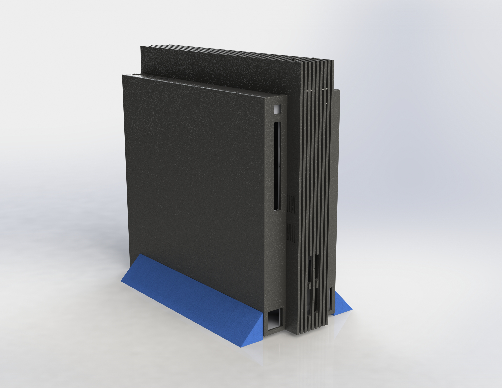
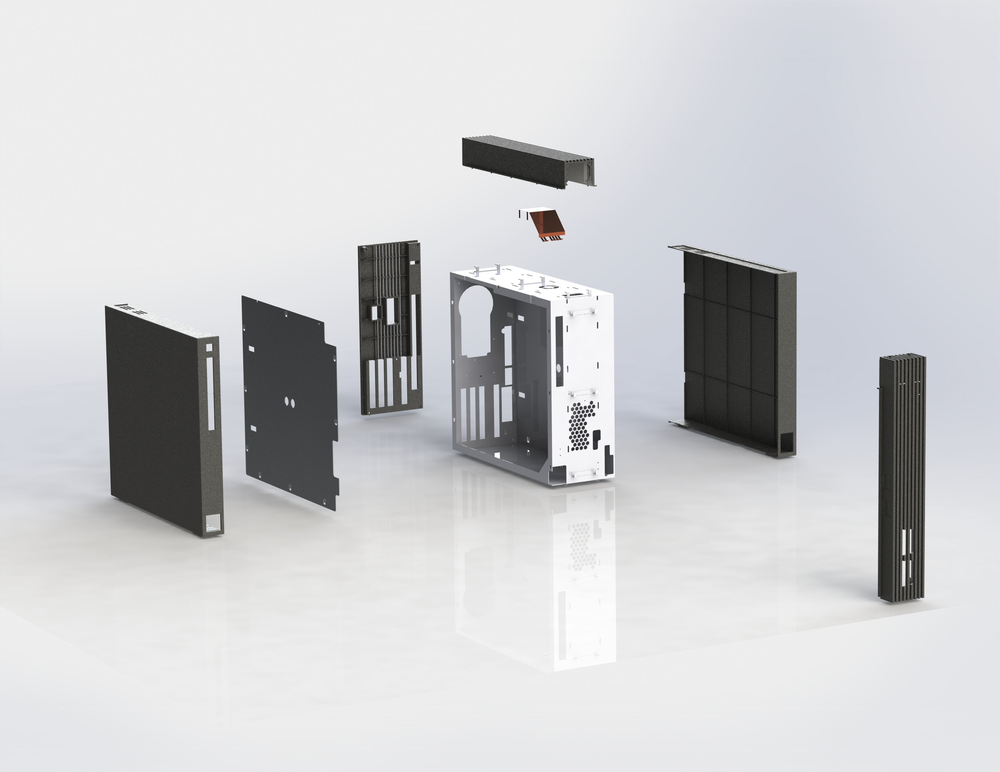

# Sony_PS2_DTL-T10000_3dModels
A collection of 3d models useful for printing and replacing parts on damaged DTL-T10000 Devkits

Unless otherwise stated, all models are in millimeters
The models are dimensionally as close as i can get them, there will be minor differences i.e. some parts i have attempted to emulate the mold draft, some do not have this.

Expect a tolerance of around 0.1mm

Some parts will be revised as anomalies are discovered.

At completion there will be 2 sets of models provided
* A like for like remodel of the original panels
* A reinforced version

Both should look almost identical from the outside.

